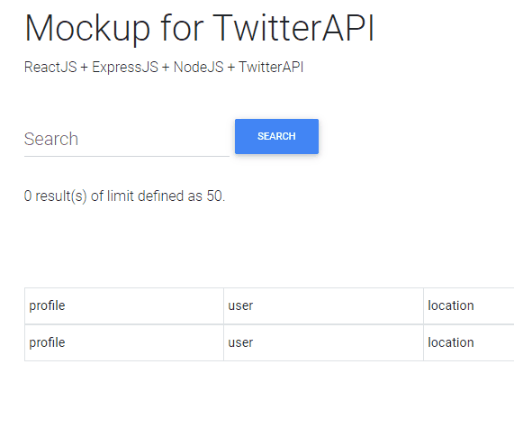
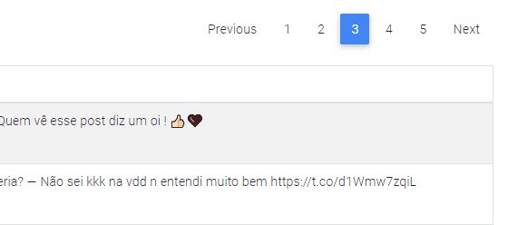
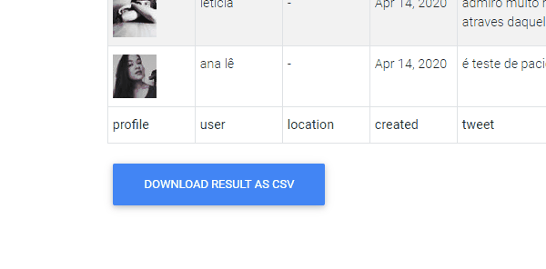

# Full-stack Mockup for Twitter API

Web application for extracting tweets through Twitter API.

#### Requirements to this Project:

- Extract tweets according to user input,
- Pagination by web interface,
- Statistics from Twitter API extraction,
- Result exportation to CSV file.

| Tweet search and Statistics |      |
| --------------------------- | ------------------------------------ |
| **Pagination**              |  |
| **Export to CSV file**      |    |

# How to run

Requirement: NodeJS (v12.16.1, more info: https://nodejs.org)

Steps to run the project locally:

- Download the project from (https://github.com/RogerRocco/reactjs-expressjs-node-twitterAPI/archive/master.zip)

- Unzip the project locally and go into it,

- Using your Terminal/CMD, inside the **back-end** directory and run: `node index.js`

- Using your Terminal/CMD, inside **front-end** directory and run: `npm start`

- Access the local web host (http://localhost) on your web browser.

  

#### ReactJS concepts implemented in the project

state and props lifecycle, multiple component levels, custom port usage, force Update, component, data transaction between components and siblings.

#### JS features implemented

Date formatting, port customization for the front and back-end, loops, arrays, ternary operator.

#### Other concepts

Rest API, OOP, a short usage of encapsulation and SOLID.

